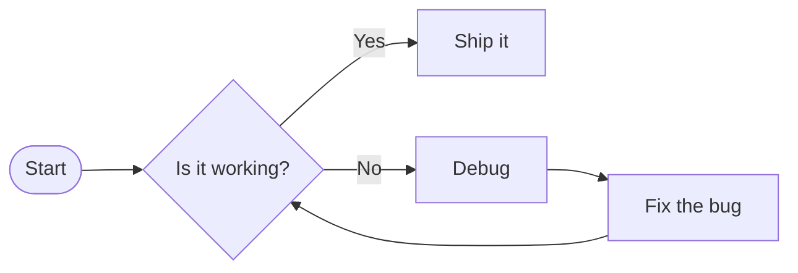

# README

Lorem ipsum dolor sit amet, consectetur adipiscing elit.

> This note is **auto-saved** to `localStorage`. Use it as a reference for everything this editor supports.

---

## 1. Text formatting

Regular paragraph text.

**Bold text** and *italic text* and ***bold italic*** and ~~strikethrough~~.

You can also write `inline code` inside a sentence, or combine **`bold code`**.

Also include common latin unicode á, ñ.

---

## 2. Headings

# H1 — Page title
## H2 — Section
### H3 — Subsection
#### H4 — Detail
##### H5 — Minor note
###### H6 — Fine print

---

## 3. Lists

**Unordered:**

- Item one
- Item two
  - Nested item
  - Another nested
- Item three

**Ordered:**

1. First step
2. Second step
3. Third step
   1. Sub-step A
   2. Sub-step B

**Task list:**

- [x] Design the layout
- [x] Add syntax highlighting
- [ ] Write documentation
- [ ] Ship it

---

## 4. Blockquotes

> "The best way to predict the future is to invent it."
> — Alan Kay

> Blockquotes can span **multiple lines** and contain `inline code` or other *formatting*.

---

## 5. Code blocks

```bash
# Install dependencies and run
npm install && npm run dev
```

---

## 6. Tables

| Feature            | Supported | Notes                        |
|--------------------|:---------:|------------------------------|
| Bold / Italic      |    T     | Standard Markdown            |
| Syntax highlighting|    T     | Via highlight.js             |
| Mermaid diagrams   |    T     | Flowcharts, sequence, etc.   |
| Table of contents  |    T     | Auto-updates as you type     |
| PDF export         |    T     | Via html2canvas + jsPDF      |
| Dark theme         |    T     | Only theme (for now)         |

---

## 7. Links, foonotes & images

[Visit the Markdown Guide](https://www.markdownguide.org)

Here is a simple footnote[^abc]. With some additional text after it.

[^abc]: My reference.


---

## 8. Mermaid diagrams



---

*Happy writing!* 
